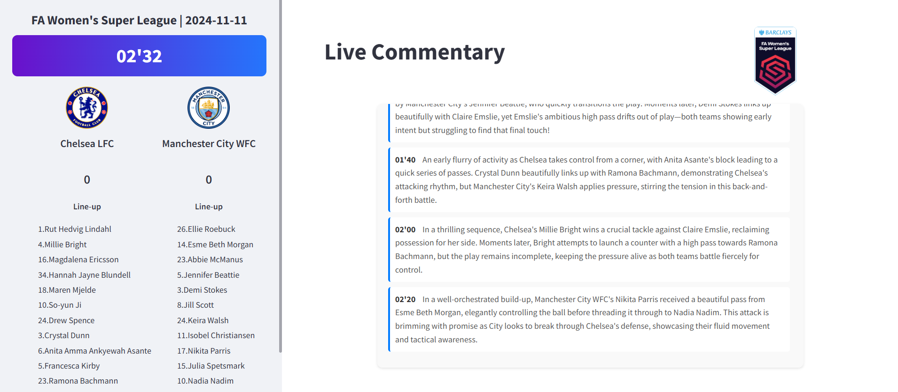

# Football Commentator



Football Commentator is an interactive application designed to deliver real-time, professional football commentary using structured event data. This project leverages data from a publicly available [Football Analytics Event Data - StatsBomb](https://www.kaggle.com/datasets/hardikagarwal1/football-analytics-event-data-statsbomb?) dataset on Kaggle. This dataset was generated by StatsBomb and curated by humans.

> **Note:** We are currently working on a new version that will automatically generate match events using computer vision techniques such as player tracking, YOLO for object detection, and action detection algorithms. This will eliminate the reliance on external, human-curated data.

---

## Overview

**Current Version:**  
- Uses curated event data from StatsBomb (via Kaggle).  
- Provides live commentary based on structured events.

**Future Version:**  
- **Automated Event Extraction:**  
  - **Player Tracking:** Continuously track players' positions.
  - **YOLO Object Detection:** Detect the ball, players, referees, and other key elements in real time.
  - **Action Detection:** Automatically classify match events (passes, shots, fouls, etc.).

---

## Features

- **Live Commentary Interface:**  
  A beautifully designed Streamlit UI with a gradient timer, team logos, scores, and player lineups displayed on the sidebar, alongside a main panel for live commentary.

- **Real-Time Event Commentary:**  
  The app uses real match events from a StatsBomb dataset to drive commentary and simulate a live broadcast.

- **Future-Proof Design:**  
  With planned enhancements in computer vision, the system will eventually generate events automatically, making it a fully automated solution.

---

## Installation

1. **Clone the Repository:**
   ```bash
   git clone https://github.com/yourusername/football-commentator.git
   cd football-commentator
   ```

2. **Install Dependencies:**
   ```bash
   uv sync
   ```


---

## Usage

### Running the Streamlit App

You can launch the app using the script defined in your `pyproject.toml`:

```bash
football-commentator
```

---

## Future Work

The next version of Football Commentator will use advanced computer vision techniques to automatically extract match events. This includes:
- **Player Tracking:** For dynamic position monitoring.
- **YOLO for Object Detection:** To detect key elements (ball, players, etc.).
- **Action Detection Algorithms:** To classify and generate events in real time.

This upgrade aims to create a fully automated solution that no longer depends on external human-curated APIs.

---

## Conclusion

Football Commentator blends data-driven insights with real-time commentary to create a dynamic broadcasting tool for football matches. With a strong foundation using curated StatsBomb data and a forward-looking vision incorporating advanced computer vision techniques, this project stands at the intersection of sports analytics and modern ML engineering.

*Contributions, suggestions, or collaborations are welcome!*

